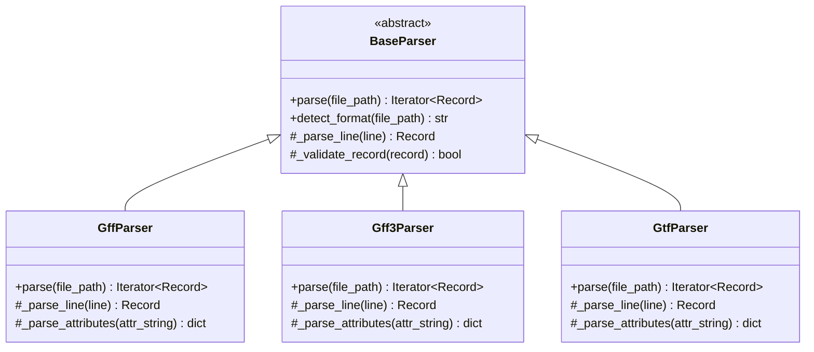
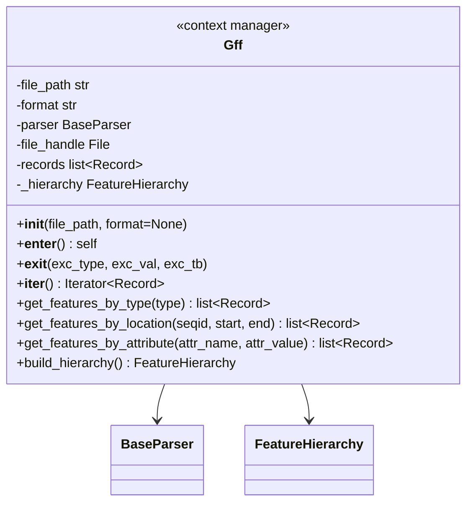

# PyGnome GFF/GTF Parser Architecture

This document outlines the architecture for the PyGnome GFF/GTF parser library, which provides a flexible and efficient way to read genomic annotation files in GFF2, GFF3, and GTF formats.

## Core Components

### 1. Base Parser with Format-Specific Implementations

The parser follows a hierarchical design with a base abstract parser class and format-specific implementations:



### 2. Record Class for Feature Representation

The `Record` class represents a single feature/annotation line from a GFF/GTF file, providing methods to access attributes and convert to different formats.

### 3. Feature Hierarchy for Parent-Child Relationships

The `FeatureHierarchy` class provides a way to work with parent-child relationships in GFF3, built on-demand (lazy loading) when needed.

### 4. Main Interface: File Reading Context Manager

The `Gff` class serves as the main interface, implemented as a context manager for reading GFF/GTF files:



## Usage Examples

### Basic File Reading with Context Manager

```python
# Using the context manager to read a GFF/GTF file
with Gff('example.gff3') as gff:
    for record in gff:
        print(f"{record.seqid}\t{record.type}\t{record.start}-{record.end}")
```

This example shows how the `Gff` class functions as a context manager for reading GFF/GTF files. The context manager handles:

1. Opening the file
2. Auto-detecting the format (if not specified)
3. Creating the appropriate parser
4. Providing an iterator interface for the records
5. Properly closing the file when done

### Filtering Features

```python
# Using the context manager with filtering capabilities
with Gff('example.gff3') as gff:
    # Consume the iterator to populate the records
    list(gff)
    
    # Get all genes
    genes = gff.get_features_by_type('gene')
    for gene in genes:
        print(f"Gene: {gene.get_attribute('ID')}")
        
    # Get features in a specific region
    region_features = gff.get_features_by_location('chr1', 1000, 2000)
    print(f"Found {len(region_features)} features in region")
```

### Working with Hierarchical Features

```python
# Using the context manager with hierarchical feature access
with Gff('example.gff3') as gff:
    # Consume the iterator to populate the records
    list(gff)
    
    # Build the hierarchy (lazy loading)
    hierarchy = gff.build_hierarchy()
    
    # Get all genes and their transcripts
    genes = gff.get_features_by_type('gene')
    for gene in genes:
        gene_id = gene.get_attribute('ID')
        transcripts = hierarchy.get_children(gene_id)
        print(f"Gene {gene_id} has {len(transcripts)} transcripts")
```

## Key Features

1. **File Reading Context Manager**: The `Gff` class is explicitly designed as a context manager for reading GFF/GTF files, handling file opening/closing automatically
2. **Format Auto-detection**: Automatically detects GFF2, GFF3, or GTF format
3. **Efficient Parsing**: Uses iterators for memory-efficient processing of large files
4. **Flexible Filtering**: Filter features by type, location, or attributes
5. **Lazy Hierarchy Building**: Flat records by default with on-demand hierarchy construction
6. **Extensible Design**: Easy to add new formats or functionality

## Extension Points

The architecture is designed to be extensible in several ways:

1. **New Format Support**: Add new parser classes by extending `BaseParser`
2. **Additional Feature Types**: The `Record` class can be extended or specialized for specific feature types
3. **Advanced Filtering**: Add more sophisticated query methods
4. **Output Formats**: Add converters to other formats (BED, JSON, etc.)
5. **Visualization**: Integrate with plotting libraries for visualization